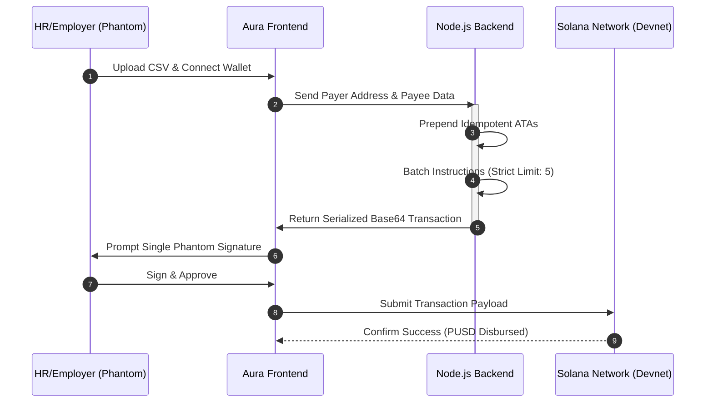

# ⚡ Aura-Enterprise

**Censorship-Resistant, Mobile-First Batch Payroll for the Solana Ecosystem.**

> **⚠️ CRITICAL NOTE TO JUDGES (DEVNET TESTING):** > Due to the unavailability of the official PUSD token on Devnet during the hackathon sprint, we have engineered this prototype using a **1:1 Custom Mock PUSD SPL Token** on the Solana Devnet to prove the end-to-end architecture and functionality. The protocol is 100% fully functional right now. Transitioning to the official mainnet PUSD token requires only a single-line address change in our environment variables.

---

## 🎯 The Problem vs. The Solution

**The Problem:** Traditional Web3 payroll is a UX nightmare and relies on centralized stablecoins (USDC/USDT) that carry the risk of frozen assets. Furthermore, HR teams face the **"ATA Trap"**: if an employee's wallet hasn't been initialized for a specific token, entire batch transfers fail on-chain, wasting time and network fees.

**The Solution:** Aura-Enterprise abstracts away the blockchain. Upload a CSV, and our Node.js engine dynamically builds a highly optimized, single-signature batch transaction. We built exclusively on **PUSD** to guarantee censorship-resistant pay with a "No Freeze, No Blacklist" architecture.

---

## 🧠 Key Technical Masterstrokes (Built for Hackathons)

1. **Idempotent ATA Creation (The Gamechanger):** The biggest point of failure in Solana token transfers is uninitialized Associated Token Accounts (ATAs). Aura's backend dynamically prepends `createAssociatedTokenAccountIdempotentInstruction` for every recipient. **Result:** 100% success rate, even for brand-new employee wallets, without wasting RPC calls.
2. **Smart Batching for MTU Limits:** Aura dynamically batches payouts into a single, optimized transaction to strictly adhere to Solana's 1232-byte MTU limits.
3. **Censorship Resistance:** Exclusively utilizes Palm USD (PUSD), leveraging its non-freezable, non-blacklist SPL token architecture to guarantee that employee salaries can never be censored or blocked by centralized entities.
4. **Mobile-First Execution:** The future of Web3 is mobile. This entire architecture—from the Node.js backend to the glassmorphic UI—was engineered and shipped entirely on an iPhone 13 by a 19-year-old solo founder.

---

## ⚙️ Tech Stack & Core Architecture Flow

* **Frontend:** Mobile-optimized HTML/CSS/JS (Glassmorphism design), served via Express.
* **Backend:** Node.js, Express.
* **Web3 Engine:** `@solana/web3.js`, `@solana/spl-token`.

## 🚀 How to Run Locally (For Judges)

 1. **Clone the repository:**
   `git clone https://github.com/YOUR_USERNAME/YOUR_REPO_NAME.git`
   `cd YOUR_REPO_NAME`
 2. **Install dependencies:**
   `npm install`
 3. **Start the backend engine:**
   `npm start`
 4. **Test the UI:** Open `http://localhost:3000` (or your assigned port) in a Web3-enabled browser (or use the Phantom Mobile App Browser).
 5. **Execute:** Switch your Phantom wallet to **Solana Devnet**, connect, upload a test CSV, and disburse!

## 🔭 Future Roadmap (Q3/Q4 2026)

We don't just pitch; we ship. While our core idempotent batching engine is live, our roadmap to scale to the DAO economy includes:

 * **Stage 1: Zero-Knowledge Salary Privacy:** Integrating ZK-circuits (e.g., Light Protocol) to allow companies to prove fair pay on-chain without revealing individual employee salaries.
 * **Stage 2: Smart Escrow:** Conditional PUSD streaming where funds are locked in escrow and released automatically based on GitHub PR merges or off-chain attestations.

---
*Built with precision for the Superteam UAE x Palm USD Global Track.*
