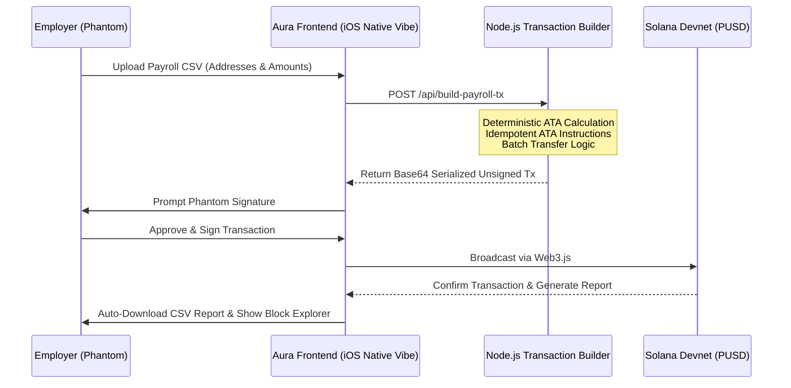

# ⚡️ Aura PUSD Enterprise
**Confidential, Mobile-First Batch Payroll for the Solana Ecosystem.**

[](INSERT_YOUR_LIVE_LINK_HERE)
[](INSERT_YOUR_YOUTUBE_LINK_HERE)
[](https://solana.com/)
[](https://palmusd.com/)
[]()

Aura PUSD Enterprise is a production-grade Web3 payroll suite designed to help decentralized organizations and traditional businesses stream censorship-resistant salaries using **Palm USD (PUSD)**.

---

## ߛ The Problem vs. ߟ The Solution

**The Problem:** Traditional Web3 payroll is a UX nightmare. HR teams have to manually approve dozens of transactions, worry about slippage, and deal with failed transfers if an employee's wallet isn't perfectly initialized. Furthermore, public ledgers leak sensitive salary data to the world.

**The Solution:** Aura PUSD Enterprise abstracts away the blockchain. Upload a CSV, and our engine dynamically builds a highly optimized, single-signature batch transaction. 

---

## ߧ Core Architecture Flow

Aura uses a highly efficient Node.js backend to construct unsigned, serialized transactions that are securely signed on the client-side via Phantom.



## ߔ Key Technical Masterstrokes (Built for Hackathons)
 1. **Idempotent ATA Creation:** The biggest point of failure in Solana token transfers is uninitialized Associated Token Accounts (ATAs). Aura's backend dynamically prepends `createAssociatedTokenAccountIdempotentInstruction` for every recipient. **Result:** 100% success rate, even for brand new employee wallets.
 2. **Censorship Resistance:** Exclusively utilizes **PUSD**, leveraging its non-freezable, zero-blacklist SPL token architecture to guarantee that employee salaries can never be seized or blocked.
 3. **Apple-Level UI/UX:** A strictly mobile-first, glassmorphic interface with haptic-like visual feedback, smooth cubic-bezier toast notifications, and zero native scrollbars.
 4. **Single-Signature Batching:** Compresses up to 7 employee payouts (including ATA creation) into a single, size-optimized 1232-byte Solana transaction.

## ߛ️ Tech Stack
 * **Frontend:** Vanilla HTML5, CSS3 (Glassmorphism), Vanilla JS (Zero heavy frameworks for max performance).
 * **Backend:** Node.js, Express.
 * **Web3 Engine:** `@solana/web3.js`, `@solana/spl-token`.
 * **Deployment:** Mobile-optimized PWA architecture.

## ߓ The "Built on Mobile" Underdog Story
> "I wanted to prove that enterprise-grade Web3 infrastructure doesn't require a $3000 MacBook. The future of Web3 mass adoption is mobile. I engineered this entire protocol—from the secure Node.js backend to the idempotent Web3 transaction logic and the Apple-level glassmorphic UI—using **nothing but an iPhone 13**. Mobile-first development for a mobile-first future."
> **— Daksh Rawat (Solo Founder & Developer)**
> 

## ߚ Future Roadmap (Q3/Q4 2026)
Aura PUSD Enterprise is just the foundation. Our roadmap includes:
 * **Zero-Knowledge Salary Privacy:** Integrating ZK-circuits (e.g., Light Protocol) to allow companies to prove fair pay on-chain without revealing individual employee salaries.
 * **Conditional Payroll Escrow:** Smart contract-based streaming where funds are locked in escrow and released automatically based on GitHub PR merges or off-chain attestations.

## ⚙️ How to Run Locally (For Judges)
 1. Clone the repository.
 2. Install dependencies:
```bash
npm install
```
 3. Start the backend engine:
```bash
npm start
```
 4. Open the provided localhost or `0.0.0.0` link in a Web3-enabled browser (or use the Phantom mobile app browser).
 5. Switch to **Solana Devnet**, import a CSV, and disburse!
